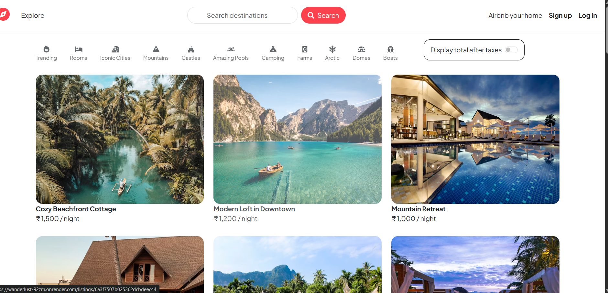
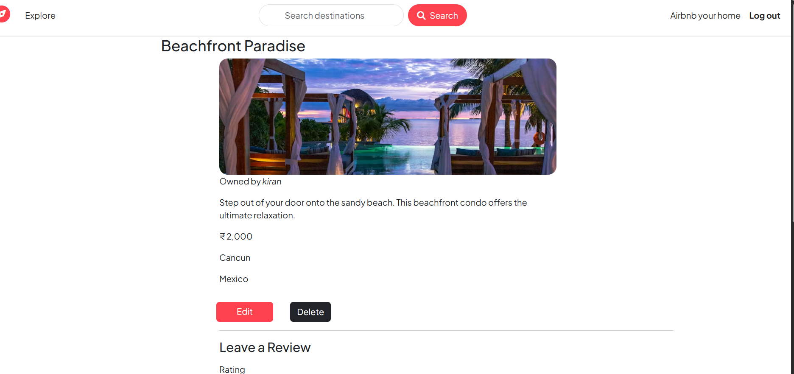
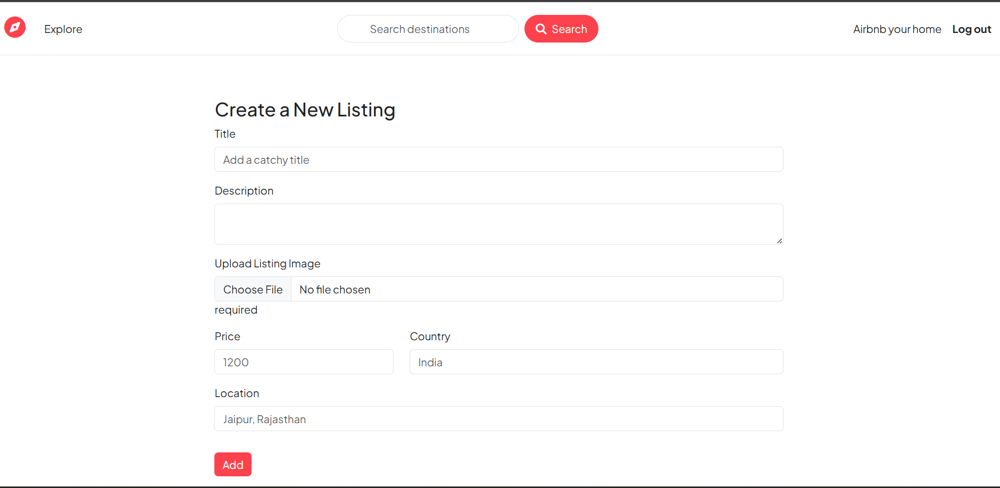

# Wanderlust 🌍

Wanderlust is a full-stack travel listing web application inspired by platforms like Airbnb. It allows users to discover, create, update, and manage travel listings while providing a secure authentication system and review functionality. The project follows the MVC architecture and demonstrates the implementation of CRUD operations, user authentication, authorization, cloud image storage, and database integration.

## Live Demo

🔗 https://wanderlust-92zm.onrender.com

## Repository

🔗 https://github.com/KiranGolada/WanderLust

---

## Features

- User registration and login
- Secure authentication using Passport.js
- Create, edit, and delete listings
- Add and delete reviews
- Authorization to ensure only listing owners can modify their listings
- Image upload and storage using Cloudinary
- Flash messages for user feedback
- Session management with MongoDB Store
- Responsive interface built using Bootstrap
- Persistent data storage with MongoDB Atlas

---

## Tech Stack

### Frontend
- HTML5
- CSS3
- Bootstrap
- JavaScript
- EJS
- EJS-Mate

### Backend
- Node.js
- Express.js

### Database
- MongoDB Atlas
- Mongoose

### Authentication & Security
- Passport.js
- Passport Local
- Passport Local Mongoose
- Express Session
- Connect Mongo

### File Storage
- Cloudinary
- Multer
- Multer Storage Cloudinary

### Deployment
- Render

---

## Project Structure

```
WanderLust
│
├── controllers
├── middleware
├── models
├── public
│   ├── css
│   ├── js
│   └── images
│
├── routes
├── utils
├── views
│
├── app.js
├── cloudConfig.js
├── middleware.js
├── schema.js
├── package.json
└── README.md
```

---

## Installation

Clone the repository

```bash
git clone https://github.com/KiranGolada/WanderLust.git
```

Move into the project directory

```bash
cd WanderLust
```

Install all dependencies

```bash
npm install
```

Create a `.env` file in the root directory and add the following variables.

```env
ATLASDB_URL=YOUR_MONGODB_ATLAS_URL

SECRET=YOUR_SECRET_KEY

CLOUD_NAME=YOUR_CLOUDINARY_NAME

CLOUD_API_KEY=YOUR_CLOUDINARY_API_KEY

CLOUD_API_SECRET=YOUR_CLOUDINARY_API_SECRET

MAP_TOKEN=YOUR_MAPBOX_ACCESS_TOKEN
```

Start the application

```bash
node app.js
```

Open your browser and visit

```
http://localhost:8080/listings
```

---

## Application Workflow

- Register a new account or log in.
- Browse available travel listings.
- Create your own listing with images.
- Update or remove listings you own.
- Add reviews to listings.
- Delete your own reviews.
- Log out securely.

---

## 📸 Screenshots

### Home Page



### Listing Details



### Add Listing



---


## Key Concepts Practiced

- MVC Architecture
- RESTful Routing
- CRUD Operations
- Authentication & Authorization
- Express Middleware
- Session Management
- File Uploads
- Form Validation using Joi
- Error Handling
- Cloud Deployment
- Environment Variables
- Git and GitHub

---

## Future Improvements

Some features that can be added in future versions:

- Search functionality
- Filter listings by category
- Interactive maps
- Booking functionality
- Wishlist feature
- User profile page
- Email verification
- Password reset

---

## Acknowledgements

This project was built as part of my learning journey in full-stack web development. It helped me gain practical experience with backend development, authentication, deployment, and database management.

---

## Author

**Kiran Golada**

GitHub: https://github.com/KiranGolada

LinkedIn: https://www.linkedin.com/in/kiran-golada-6a1890366

---

If you found this project useful or have suggestions for improvement, feel free to open an issue or contribute.